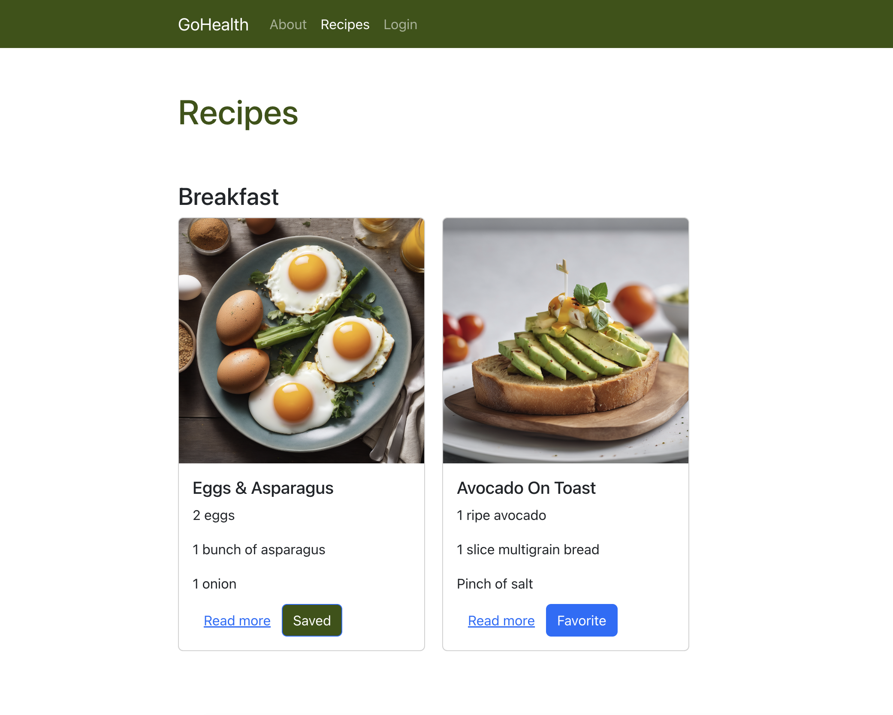
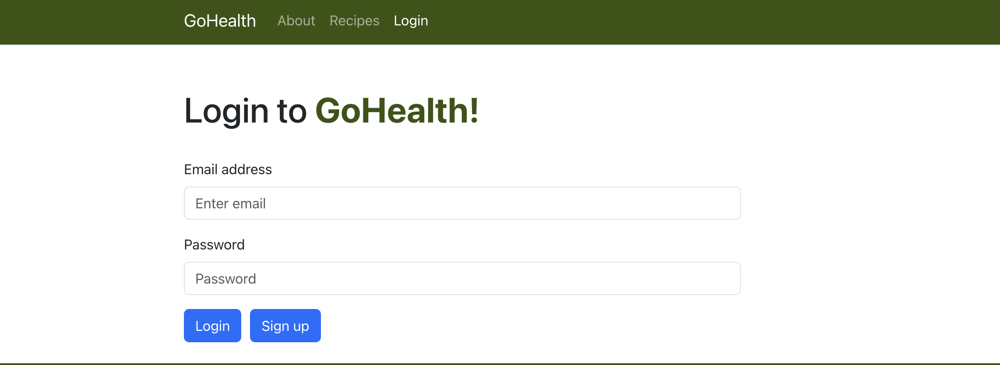

# GoHealth
# Project Three – Group Five
# Created By: 
- Cody Deering
- Candace Gostinski
- Daniel Moretz
- Matthew Otabor

## Description
A site designed to help customers find healthy recipes for their dietary and health concerns.

## Technologies Used
Node
React/React-Router-Dom
MongoDB/Mongoose
JWT
Express
Apollo
GraphQL
Concurrently

## Usage
GoHealth is designed to be used by customers searching for healthier alternative options for their food intake. They can find a list of ingredients and directions for each recipe by visiting our recipe page. 

### Screenshots of GoHealth application 

## Links
### [Link to GitHub repo](https://github.com/CandaceG00/GoHealth)
### [Link to deployed Heroku app](https://gohealth-78e1998b3c54.herokuapp.com/)